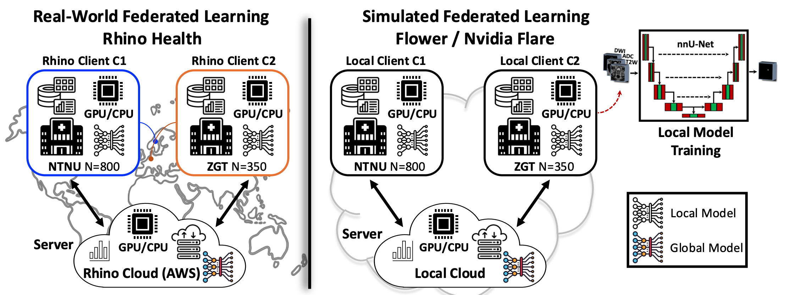
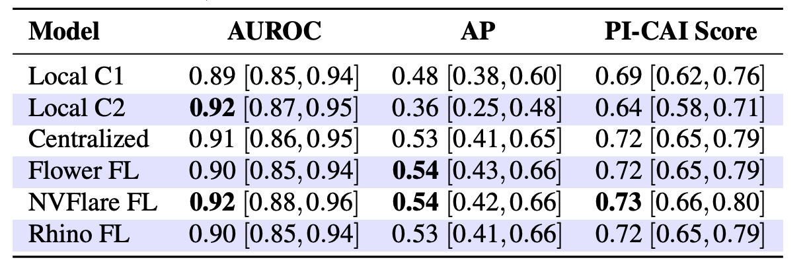
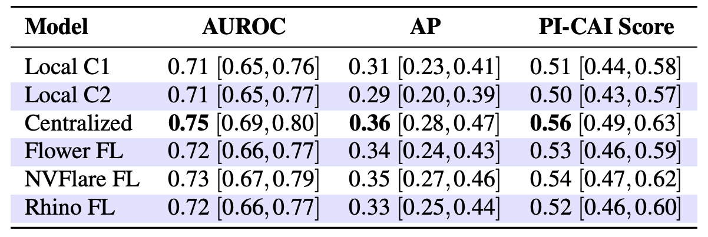
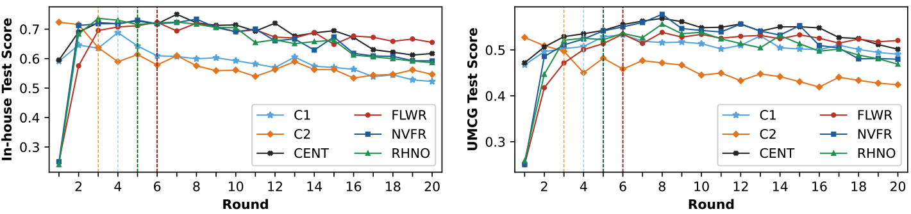
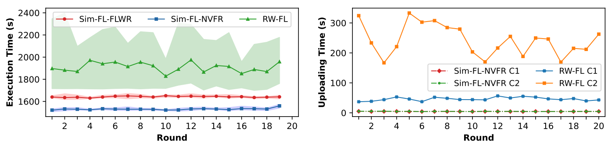
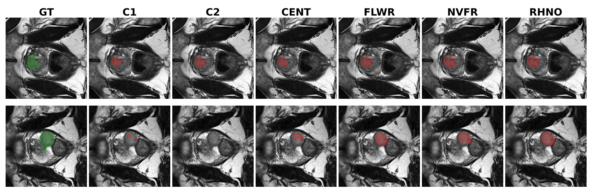

# Real-World Federated Learning for MRI Prostate Cancer Detection

**Beyond the Sandbox: Real-World Federated Learning for MRI Prostate Cancer Detection:**  
In this work, we investigate the real-world implementation of Federated Learning for MRI-based prostate cancer detection and compare the results with simulated implementations using **[NVIDIA FLARE](https://nvflare.readthedocs.io/en/latest/)** and **[Flower](https://flower.ai/)**. The experiment involves two clients: the **[Norwegian University of Science and Technology (NTNU)](https://www.ntnu.edu/)** in Norway  and **[Ziekenhuisgroep Twente (ZGT)](https://www.zgt.nl/)** in the Netherlands. The real-world FL implementation is conducted using the **[Rhino Federated Computing](https://www.rhinofcp.com/)** framework, which was developed on top of **[NVIDIA FLARE](https://nvflare.readthedocs.io/en/latest/)**.

<div align="center">
  
  <br>
  <em>Figure 1: Comparison of real-world and simulated federated learning topologies.</em>
</div>

### Abstract:
The success of computer-assisted methods based on deep learning for the early detection of prostate cancer (PCa) has attracted significant attention in recent years. Successful training of such models, however, requires access to large amounts of patient data. This data is typically not available at a single institution, and sharing patient-specific information raises privacy concerns. Federated learning (FL) thus emerges as a viable solution that enables decentralized model training without the need to share patient data. In this study, we design and implement a real-world FL solution for the detection of clinically significant prostate cancer in biparametric MRI. We benchmark the performance by conducting centralized model training and simulated FL experiments using the Flower FL and NVIDIA FLARE frameworks, and compare these results with those from a realworld FL solution implemented using the Rhino Federated Computing platform. The results showed that FL-based models outperformed local models and achieved performance comparable to the centralized model. Furthermore, the real-world FL model closely replicated the performance of simulated FL models and demonstrated that the choice of FL implementation framework had minimal impact on performance across external test sets. Additionally, we provided a time performance analysis for simulated and real-world FL scenarios, highlighting the longer execution time and challenges in implementing FL in practice.

#### Used Datasets:
<div align="center">
  
  <br>
  <em>Table 1: Dataset distribution for csPCa detection across different clients.</em>
</div>

#### Detection Performance:
<div align="center">
  
  <br>
  <em>Table 2: Performance metrics and 95% confidence interval for the ensemble of the 5-fold cross-validated best models, evaluated on the in-house test set.</em>
</div>

<div align="center">
  
  <br>
  <em>Table 3: Performance metrics and 95% confidence interval for the ensemble of the 5-fold cross-validated best models, evaluated on the UMCG test set.</em>
</div>

<div align="center">
  
  <br>
  <em>Figure 2: Comparison of the ensembled PI-CAI scores for trained models evaluated on various test sets. Dashed lines indicate the round at which the average validation PI-CAI score across clients and folds peaked for each curve.</em>
</div>

#### Execution Time Analysis:

<div align="center">
  
  <br>
  <em>Figure 3: Time analysis per training round for simulated FL based on Flower (Sim-FLFLWR), simulated FL based on NVFlare (Sim-FL-NVFR), and real-world FL based on Rhino (RW-FL).</em>
</div>

#### Qualitative Performance:
<div align="center">
  
  <br>
  <em>Figure 4: Qualitative performance comparison of predictions from different models on test patients from the in-house test set. Each row shows the lesions predicted by different models for a single test case.</em>
</div>


## Installation:
Clone the repository to your local system and install the required packages using `requirements.txt`. Alternatively, you can build the Docker image and work inside the container.

```bash
git clone https://github.com/AshknMrd/moradi2025realworldFL.git
cd moradi2025realworldFL

# Create and activate a Conda environment
conda create -n myenv python=3.10.12
conda activate myenv
```

Next, install our Flower app and its dependencies, as well as the modified nnU-Net package:

```bash
# Install the Flower app
cd flwr-ntnu-zgt
pip install -e .

# Install the modified nnU-Net package
cd nnUNet
pip install -e .
```
Finally, install the remaining required packages:
```bash
pip install -r requirements.txt
```

Before starting the experiments, make sure that your dataset at each client site is downloaded and organized in the following format.

```
workdir/  
├── nnUNet_raw/  
│   └── Dataset101_client_name/  
│       ├── imagesTr/  
│       ├── labelsTr/  
│       └── dataset.json
├── nnUNet_preprocessed/  
└── nnUNet_results/  
```

## Usage:
To reuse this repository, you must first create a working directory that includes the nnU-Net folders and dataset folders, following the same structure described in our previous repository: [moradi2025rai](https://github.com/AshknMrd/moradi2025rai). To rerun the experiment, you can assign each client to a different GPU and run the server on a separate GPU. The experiments can also be reproduced using a single GPU by sharing resources between the two clients and the server.

### Nvidia FLARE client:
The script for the NVFLARE client is provided in the `nvflare_client_local` folder. You can start the experiment in deployment mode, where you first generate the provisioning settings for all participants. Before submitting the job, you should also verify the correctness of each startup kit. For every client, the server, and the admin, run their respective startup scripts in the command line and ensure that each client successfully connects to the server. Once all connections are established, submit the job from the admin side. Further details on how to submit a job for an NVFLARE client are available on their [main page](https://nvflare.readthedocs.io/en/latest/).

### Flower client:
The script for the NVFLARE client is provided in the `flwr-ntnu-zgt` folder. By activateing your environment from each client and the server side, you can initialize the SuperLink from the server-terminal on the available ports, lets assume you have `port-i` available for inter-machine connections, then
```bash
flower-superlink \
  --insecure \
  --serverappio-api-address 0.0.0.0:9091 \
  --fleet-api-address 0.0.0.0:port-i \
  --exec-api-address 0.0.0.0:9093
```
Subsequently, the SuperNodes can be run from client's terminal:
```bash
flower-supernode \
     --insecure \
     --superlink 10.5.5.165:port-i \
     --clientappio-api-address 127.0.0.1:9093 \
     --node-config "partition-id=0 num-partitions=2"

flower-supernode \
     --insecure \
     --superlink 10.5.5.165:port-i \
     --clientappio-api-address 127.0.0.1:9094 \
     --node-config "partition-id=1 num-partitions=2"
```
Then the deployment configuration in the pyproject.toml file can be updated by adding and setting up the rest of the setting as desired:
```bash
[tool.flwr.federations.local-deployment]
address = "127.0.0.1:9093"
insecure = true
```
Finally from the serveer side the App can be triggered to start the training using `cd flwr_client/flwr-ntnu-zgt` and `flwr run . local-deployment --stream`.


## 📖 Citation
The method was developed at the [CIMORe](https://www.ntnu.edu/isb/mr-cancer) - Cancer Imaging and Multi-Omics Research Group at the Norwegian University of Science and Technology (NTNU) in Trondheim, Norway. For detailed information about this method, please read our [BMVC conference paper](https://bmva-archive.org.uk/bmvc/2025/assets/workshops/DIFA/Paper_3/paper.pdf) or the [Radiology Artificial Intelligence manuscript](https://pubs.rsna.org/doi/abs/10.1148/ryai.240485). If you use this work, please cite:

```bibtex
@inproceedings{moradi2024federated,
  title={Beyond the Sandbox: Real-World Federated Learning for MRI Prostate Cancer Detection},
  author={Moradi, Ashkan and Abrahamsen, Bendik Skarre and Geerdink, Jeroen and Yakar, Derya and Huisman, Henkjan and Bathen, Tone Frost and Elschot, Mattijs},
  booktitle={The British Machine Vision Conference (BMVC)},
  volume={},
  pages={},
  year={2025}}
```
and
```bibtex
@article{moradi2025optimizing,
  title={Optimizing Federated Learning Configurations for MRI Prostate Segmentation and Cancer Detection: A Simulation Study},
  author={Moradi, Ashkan and Zerka, Fadila and Bosma, Joeran Sander and Sunoqrot, Mohammed RS and Abrahamsen, Bendik S and Yakar, Derya and Geerdink, Jeroen and Huisman, Henkjan and Bathen, Tone Frost and Elschot, Mattijs},
  journal={Radiology: Artificial Intelligence},
  pages={e240485},
  year={2025},
  publisher={Radiological Society of North America}
}
```


## Acknowledgements
The authors gratefully acknowledge [Rhino Federated Computing](https://www.rhinofcp.com/) for providing access to their platform and for their valuable support throughout the implementation of this work. This work was supported by the Norwegian Cancer Society and Prostatakreftforeningen under the Project FLIP.AI – Federated Learning to Improve Prostate cancer imaging with Artificial Intelligence with Project code: 215951. Additionally, we extend our gratitude to the developers of [Flower](https://flower.ai/), [nnU-Net](https://github.com/MIC-DKFZ/nnUNet), and the [PI-CAI](https://pi-cai.grand-challenge.org/) Grand Challenge for making their important contributions publicly accessible.

